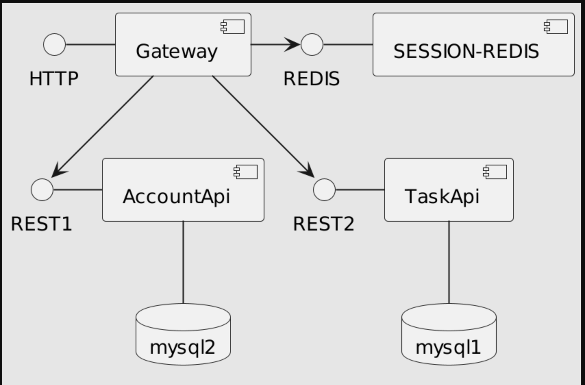

# Gateway

- **gateway 는 모든 서비스 요청을 받으며 프레젠테이션 기능을 담당합니다**.
    - TemplateEngine(**Thymeleaf**) 사용하여 화면을 표시합니다.
    - 데이터는 AccountApi, TaskApi 를 **RestTempate**으로 호출하여 받아 옵니다.
    - 화면정보를 표시할때 AccountApi, TaskApi 를 조합해서 제공할 수 있어야 합니다.
- gateway 는 사용자의 인증을 담당합니다.
    - 인증 세션은 gateway 서버에서 redis 를 사용하여 관리합니다.
        - **Spring Session쓰지말고 RedisTemplate을 사용해 주세요.**
    - 인증 데이터는 Account-Api 를 사용합니다.
- AccountApi 는 멤버의 정보를 관리합니다.
- ProjectApi 는 Project, Task, Comment, Tag 를 관리 합니다.

## 기술 목록

- Spring Boot
- Spring Security
- Redis
- Thymeleaf

## Note

### Spring Security

Authentication (인증) -> Authorization (권한부여)

이 Authentication이 어디에 보관되는가? : SecurityContext

SecurityContext를 들고있는 녀석: SecurityContextHolder (ThreadLocal)

- @EnableWebMVC
- uri
- implemente WebMvcConfigurer